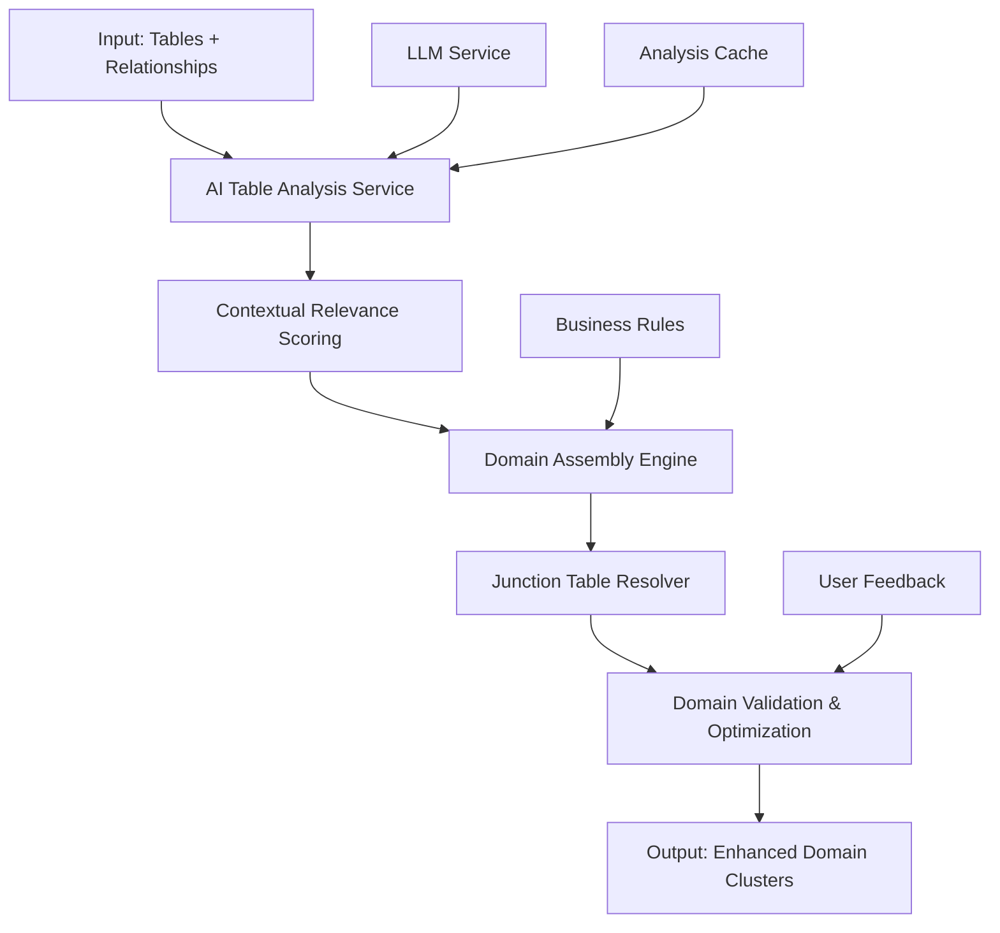
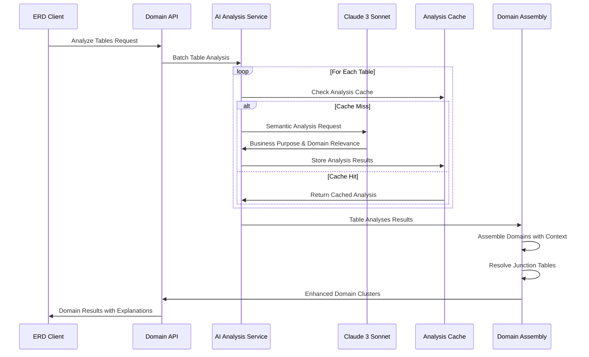
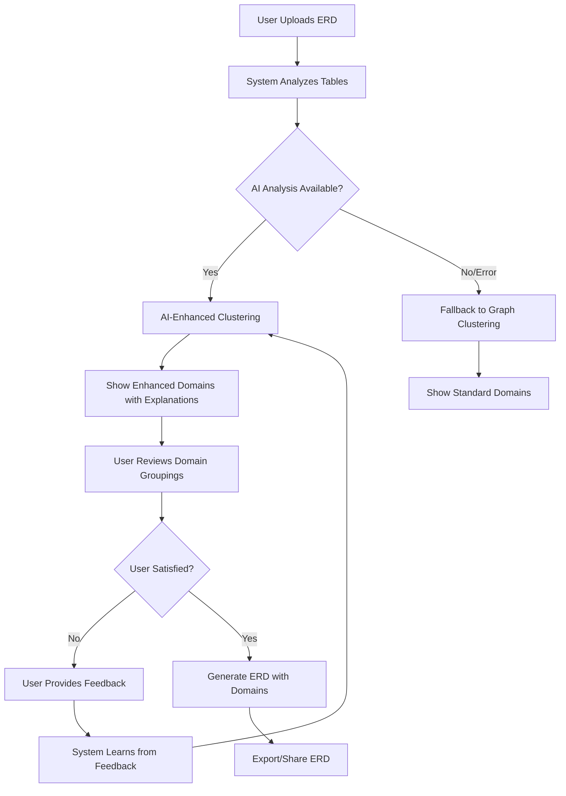

# AI-Enhanced Domain Clustering System
## Product Requirements Document (PRD)

### Version: 1.0
### Date: August 2025
### Status: Design Phase

---

## 1. Executive Summary

### Problem Statement
Current ERD domain clustering relies on hardcoded regex patterns that cannot adapt to different industries or understand semantic relationships between tables. This results in poor domain groupings where:
- Junction tables like `CampaignDonation` get misplaced due to FK connections rather than business purpose
- Tables like `Users` either get excluded from relevant domains or included in irrelevant ones
- Industry-specific terminology (e.g., "checkout" vs "billing" vs "invoicing") isn't semantically understood
- Manual pattern maintenance is required for each new business model

### Solution Overview
An AI-enhanced domain clustering system that uses Large Language Models (LLMs) to understand the semantic purpose of database tables and intelligently group them into business-relevant domains. The system maintains lightweight architecture while providing contextual understanding of table relationships.

### Key Benefits
- **Industry Agnostic**: Works for healthcare, fintech, retail, nonprofits without hardcoded rules
- **Contextual Intelligence**: Understands WHY tables belong together, not just that they're connected
- **Balanced Domain Assembly**: Includes relevant tables while excluding irrelevant connections
- **Junction Table Intelligence**: Places bridge tables based on primary business purpose
- **Cost Effective**: <$1 per analysis with caching, significantly cheaper than manual rule maintenance

---

## 2. Problem Definition

### Current System Limitations

#### 2.1 Hardcoded Pattern Matching
```typescript
// Current BusinessRuleEngine approach
payments_donations: {
  patterns: [
    /\bpayment\b/i,
    /\bcheckout\b/i,
    /\bbilling\b/i,
    // ... more hardcoded patterns
  ]
}
```

**Issues:**
- Misses semantic variations: "CartTotal", "OrderSummary", "TransactionLedger"
- Requires manual updates for new industries
- Cannot understand context: "UserBilling" vs "SystemBilling"

#### 2.2 Over-inclusion Problem
**Current**: Tables connected to `Users` all get grouped together
**Result**: Donations domain includes `UserPreferences`, `UserSessions`, `UserAnalytics`
**Needed**: Only `Users` data relevant to donations (donor profiles, giving history)

#### 2.3 Junction Table Misplacement
**Example**: `CampaignDonation` table
- **Current Logic**: Split between Campaigns and Donations domains (FK-based)
- **Business Reality**: Belongs in Donations domain (primary purpose is recording donations)
- **Impact**: Broken domain cohesion, incomplete business contexts

### Real-World Impact
1. **Poor User Experience**: ERD domains don't reflect actual business workflows
2. **Incomplete Business Views**: Missing tables make domains unusable for business analysis
3. **Maintenance Overhead**: Each new customer requires custom regex patterns
4. **Scalability Issues**: Pattern complexity grows exponentially with business complexity

---

## 3. Solution Architecture

### 3.1 High-Level Architecture



### 3.2 Component Breakdown

#### 3.2.1 AI Table Analysis Service
**Purpose**: Analyze individual tables to understand their business purpose and domain relevance

**Input**:
```typescript
interface TableData {
  name: string;
  columns: Column[];
  relationships: Relationship[];
}
```

**Output**:
```typescript
interface TableDomainAnalysis {
  tableName: string;
  primaryPurpose: string;           // "Records donations from donors to campaigns"
  businessDomains: string[];        // ["donations", "payments", "campaigns"]
  domainContexts: Map<string, {
    relevanceScore: number;         // 0.0-1.0
    contextualRole: string;         // "Serves as donor profiles"
    reasoning: string;              // "Contains donor info needed for donations"
  }>;
  suggestedColumns: Map<string, string[]>; // domain -> relevant columns
}
```

#### 3.2.2 Domain Assembly Engine
**Purpose**: Group tables into cohesive business domains using contextual relevance

**Core Algorithm**:
1. **Core Entity Identification**: Find tables that obviously belong to specific domains
2. **Contextual Expansion**: Include related tables only when they serve the domain's purpose
3. **Boundary Detection**: Determine where domain responsibility ends
4. **Multi-Domain Membership**: Allow tables to serve multiple domains in different contexts

#### 3.2.3 Junction Table Resolver
**Purpose**: Intelligently place junction tables based on their primary business purpose

**Decision Logic**:
```typescript
// Example: CampaignDonation placement
const junctionAnalysis = {
  table: "CampaignDonation",
  connectedDomains: ["campaigns", "donations"],
  primaryPurpose: "Records which donations were made to which campaigns",
  businessProcess: "donation_recording", 
  placement: "donations", // Based on primary purpose, not FK count
  reasoning: "Amount and date fields indicate donation transaction focus"
}
```

### 3.3 Data Flow



---

## 4. Technical Specifications

### 4.1 Core Interfaces

```typescript
// Main service interface
export interface IntelligentDomainAnalyzer {
  analyzeTable(table: TableData): Promise<TableDomainAnalysis>;
  assembleDomains(tables: TableData[]): Promise<DomainCluster[]>;
  resolveJunctionTables(domains: DomainCluster[], analyses: TableDomainAnalysis[]): Promise<DomainCluster[]>;
}

// Enhanced domain cluster output
export interface DomainCluster {
  name: string;                     // "donations", "campaigns", etc.
  displayName: string;              // "Donations & Payments"
  purpose: string;                  // Business purpose description
  coreTables: Set<string>;          // Tables that definitely belong (score >= 0.8)
  contextualTables: Map<string, {   // Tables in specific context (score >= 0.4)
    relevanceScore: number;
    role: string;
    columns: string[];              // Only relevant columns
    reasoning: string;
  }>;
  junctionTables: Set<string>;      // Bridge tables assigned here
  excludedTables: Map<string, string>; // Tables excluded + reasons
  cohesionScore: number;            // Domain coherence metric
  totalTables: number;
  businessMetrics: {
    completeness: number;           // How complete this business view is
    independence: number;           // How independent from other domains
    usability: number;             // How useful for business analysis
  };
}
```

### 4.2 LLM Integration

#### 4.2.1 Table Analysis Prompt
```typescript
const TABLE_ANALYSIS_PROMPT = `
Analyze this database table for business domain classification:

Table: {{tableName}}
Columns: {{columns}}
Sample Relationships: {{relationships}}

Determine:
1. PRIMARY_PURPOSE: What is this table's main business function?
2. BUSINESS_DOMAINS: Which business areas does this serve? (e.g., user_management, payments, campaigns, analytics, content_management)
3. For each domain, provide:
   - RELEVANCE: 0.0-1.0 score
   - ROLE: What role does this table play in that domain?
   - REASONING: Why does it belong (or not belong)?
   - COLUMNS: Which columns are relevant to this domain?

Format your response as structured data:
PRIMARY_PURPOSE: [description]
DOMAINS: [domain1, domain2, domain3]
DOMAIN_ANALYSIS:
- domain1: relevance=0.9, role="X", reasoning="Y", columns=[col1,col2,col3]
- domain2: relevance=0.6, role="Z", reasoning="W", columns=[col4,col5]

Focus on business purpose over technical connections.
`;
```

#### 4.2.2 Junction Table Resolution Prompt
```typescript
const JUNCTION_RESOLUTION_PROMPT = `
This table connects multiple entities and could belong to different domains:

Table: {{tableName}}
Columns: {{columns}}
Connected Entities: {{connectedEntities}}
Possible Domains: {{possibleDomains}}

Determine the PRIMARY domain this table serves:

Consider:
1. What business process does this table enable?
2. What is the main purpose of the data it stores?
3. Which domain would be incomplete without this table?
4. What workflow does this table primarily support?

Analyze the table's semantic purpose, not just its foreign key relationships.

PRIMARY_DOMAIN: [domain]
CONFIDENCE: [0.0-1.0]
REASONING: [detailed explanation]
BUSINESS_PROCESS: [primary workflow this enables]
`;
```

### 4.3 Caching Strategy

```typescript
interface AnalysisCache {
  tableAnalyses: Map<string, {
    analysis: TableDomainAnalysis;
    timestamp: number;
    schemaHash: string;              // Hash of table structure
    expiryTime: number;             // TTL for cache invalidation
  }>;
  
  domainAssemblies: Map<string, {
    domains: DomainCluster[];
    timestamp: number;
    tablesHash: string;             // Hash of all tables in the analysis
    version: string;                // System version for compatibility
  }>;
}

// Cache invalidation rules
const CACHE_RULES = {
  tableAnalysisExpiry: 7 * 24 * 60 * 60 * 1000, // 7 days
  domainAssemblyExpiry: 24 * 60 * 60 * 1000,     // 1 day
  maxCacheSize: 1000,                             // Maximum cached analyses
  autoCleanup: true                               // Automatic cleanup of old entries
};
```

---

## 5. User Experience Flows

### 5.1 Domain Discovery Workflow



### 5.2 Enhanced User Interface

#### 5.2.1 Domain Explanation Panel
```typescript
interface DomainExplanationUI {
  domainName: string;
  purpose: string;
  tableGroups: {
    core: {
      tables: string[];
      explanation: "These tables are central to this business domain";
    };
    contextual: {
      tables: Array<{
        name: string;
        role: string;
        reasoning: string;
        relevantColumns: string[];
      }>;
      explanation: "These tables serve this domain in specific contexts";
    };
    junction: {
      tables: string[];
      explanation: "These bridge tables primarily serve this domain's business processes";
    };
  };
  excludedTables: Array<{
    name: string;
    reason: string;
    suggestedDomain: string;
  }>;
  confidenceScore: number;
  businessMetrics: {
    completeness: number;
    independence: number;
    usability: number;
  };
}
```

#### 5.2.2 User Feedback Interface
```typescript
interface FeedbackUI {
  domainCorrections: Array<{
    tableName: string;
    currentDomain: string;
    suggestedDomain: string;
    userReasoning: string;
  }>;
  tableRoleCorrections: Array<{
    tableName: string;
    domain: string;
    currentRole: string;
    suggestedRole: string;
  }>;
  newDomainSuggestions: Array<{
    domainName: string;
    purpose: string;
    suggestedTables: string[];
  }>;
}
```

---

## 6. Implementation Roadmap

### Phase 1: Core AI Integration (Weeks 1-2)
**Goals**: Replace hardcoded patterns with AI analysis

**Deliverables**:
- [ ] `IntelligentDomainAnalyzer` service implementation
- [ ] LLM prompt engineering and testing
- [ ] Basic caching mechanism
- [ ] Integration with existing `AdvancedDomainAnalyzer`
- [ ] Environment variable configuration (`USE_INTELLIGENT_CLUSTERING`)

**Success Criteria**:
- AI can analyze 100 tables in <60 seconds
- Analysis accuracy > 80% compared to manual classification
- System falls back gracefully to current clustering on AI failure

### Phase 2: Domain Assembly Engine (Weeks 3-4)  
**Goals**: Implement contextual domain grouping

**Deliverables**:
- [ ] `DomainAssemblyEngine` with contextual relevance scoring
- [ ] Junction table resolution logic
- [ ] Multi-domain table membership support
- [ ] Domain boundary detection algorithms

**Success Criteria**:
- Domains show clear business coherence
- Junction tables placed in semantically correct domains
- Tables appear in multiple domains only when contextually relevant

### Phase 3: User Experience Enhancements (Weeks 5-6)
**Goals**: Provide transparency and user control

**Deliverables**:
- [ ] Domain explanation UI components
- [ ] User feedback collection system
- [ ] Performance monitoring and metrics
- [ ] A/B testing framework for AI vs traditional clustering

**Success Criteria**:
- Users understand why tables were grouped
- Feedback collection improves clustering accuracy over time
- Domain explanations are clear and actionable

### Phase 4: Learning and Optimization (Weeks 7-8)
**Goals**: Implement continuous improvement

**Deliverables**:
- [ ] User feedback learning system
- [ ] Performance optimization (batch processing, parallel analysis)
- [ ] Industry-specific domain pattern recognition
- [ ] Advanced caching with intelligent invalidation

**Success Criteria**:
- System learns from corrections and improves accuracy
- Analysis time reduced by 50% through optimization
- Industry-specific clustering accuracy > 90%

---

## 7. Success Metrics & KPIs

### 7.1 Technical Performance

| Metric | Target | Current | Measurement Method |
|--------|---------|---------|-------------------|
| Analysis Speed | <60s for 100 tables | N/A | Execution time monitoring |
| Memory Usage | <50MB peak | N/A | Process memory tracking |
| Cache Hit Rate | >80% | N/A | Cache statistics |
| API Response Time | <500ms for cached results | N/A | Response time logs |
| System Availability | >99.5% | N/A | Uptime monitoring |

### 7.2 Quality Metrics

| Metric | Target | Measurement Method |
|--------|---------|-------------------|
| Domain Accuracy | >85% correct groupings | User feedback + expert validation |
| Junction Table Placement | >90% semantically correct | Business logic validation |
| User Satisfaction | >4.0/5.0 rating | In-app feedback surveys |
| Domain Explanation Clarity | >4.0/5.0 rating | User comprehension surveys |
| Reduced Manual Corrections | 50% fewer corrections | Before/after comparison |

### 7.3 Business Impact

| Metric | Target | Current | Impact |
|--------|---------|---------|---------|
| Setup Time for New Industry | <2 hours | ~2 weeks | 95% time reduction |
| Customer Onboarding Speed | <1 day | ~1 week | Faster revenue realization |
| Support Tickets (Clustering) | <5 per month | ~20 per month | Reduced support load |
| Feature Adoption Rate | >60% of ERDs use enhanced clustering | N/A | Product stickiness |

### 7.4 Cost Metrics

| Component | Monthly Cost | Notes |
|-----------|--------------|-------|
| LLM API Calls | <$50 for 1000 analyses | Claude 3 Sonnet, cached results |
| Additional Infrastructure | $0 | Uses existing servers and storage |
| Development Time Savings | $10,000+ value | Reduced custom pattern maintenance |
| Customer Success Impact | $25,000+ value | Faster onboarding, fewer issues |

---

## 8. Risk Assessment & Mitigation

### 8.1 Technical Risks

#### Risk 1: LLM API Reliability
**Impact**: High - System unusable if LLM fails
**Probability**: Medium - External API dependency
**Mitigation**:
- Robust fallback to current graph-based clustering
- Circuit breaker pattern for LLM calls
- Local model fallback option (future consideration)
- Comprehensive error handling and user messaging

#### Risk 2: Analysis Quality Inconsistency  
**Impact**: Medium - Poor domain groupings
**Probability**: Medium - LLM outputs can vary
**Mitigation**:
- Confidence scoring for all analysis results
- Multiple validation approaches (cross-validation)
- User feedback loop to correct and learn
- A/B testing against current system

#### Risk 3: Performance Degradation
**Impact**: Medium - Slow user experience  
**Probability**: Low - Well-architected caching
**Mitigation**:
- Aggressive caching strategy with intelligent invalidation
- Batch processing for bulk operations
- Async processing for large schemas
- Performance monitoring and alerting

### 8.2 Business Risks

#### Risk 1: User Adoption Resistance
**Impact**: Medium - Feature not used
**Probability**: Low - Clear benefits
**Mitigation**:
- Gradual rollout with opt-in mechanism
- Clear explanation of benefits and reasoning
- Side-by-side comparison with current results
- Training and documentation

#### Risk 2: Increased Operating Costs
**Impact**: Medium - Budget impact
**Probability**: Low - Cost-controlled implementation
**Mitigation**:
- Strict caching to minimize LLM calls
- Usage monitoring and alerting
- Cost caps and circuit breakers
- ROI tracking and optimization

### 8.3 Monitoring & Alerting

```typescript
interface MonitoringConfig {
  performance: {
    analysisTimeThreshold: 120000;      // 2 minutes max
    memoryUsageThreshold: 100 * 1024 * 1024; // 100MB max
    cacheHitRateMinimum: 0.7;          // 70% minimum hit rate
  };
  quality: {
    confidenceScoreMinimum: 0.6;       // 60% minimum confidence
    userFeedbackRating: 3.5;           // Minimum rating threshold
    errorRateMaximum: 0.05;            // 5% maximum error rate
  };
  cost: {
    monthlyLLMCostLimit: 100;          // $100 maximum per month
    analysisCountDaily: 500;           // Maximum analyses per day
    costPerAnalysisMaximum: 0.10;      // $0.10 maximum per analysis
  };
}
```

---

## 9. Examples & Use Cases

### 9.1 Donations Domain Example

#### Input Tables:
```
- Users (id, name, email, password, donation_total, first_donation_date, preferences)
- Campaigns (id, name, goal, current_amount, start_date, end_date, category, analytics)
- Donations (id, user_id, campaign_id, amount, date, payment_method)
- CampaignDonation (campaign_id, donation_id, amount, fee, net_amount)
- PaymentMethods (id, user_id, type, details, is_default)
- UserPreferences (user_id, email_frequency, notifications, ui_theme)
- CampaignAnalytics (campaign_id, views, clicks, conversion_rate, demographics)
```

#### AI Analysis Results:
```typescript
const donationsDomainResult = {
  name: "donations",
  displayName: "Donations & Payments", 
  purpose: "Process donations from donors to campaigns, manage donor relationships, handle payment processing",
  
  coreTables: new Set([
    "Donations",           // relevance: 1.0 - core entity
    "PaymentMethods"       // relevance: 0.9 - essential for donation processing
  ]),
  
  contextualTables: new Map([
    ["Users", {
      relevanceScore: 0.85,
      role: "Donor profiles and giving history",
      columns: ["id", "name", "email", "donation_total", "first_donation_date"],
      reasoning: "Users are donors in this context - need contact info and giving history, exclude system preferences"
    }],
    ["Campaigns", {
      relevanceScore: 0.80,
      role: "Donation targets and campaign context", 
      columns: ["id", "name", "goal", "current_amount", "end_date", "category"],
      reasoning: "Campaigns are donation destinations - need basic campaign info, exclude detailed analytics"
    }]
  ]),
  
  junctionTables: new Set([
    "CampaignDonation"     // Primary purpose: donation transaction recording
  ]),
  
  excludedTables: new Map([
    ["UserPreferences", "System preferences not relevant to donation processing - belongs in user_management"],
    ["CampaignAnalytics", "Performance analytics not needed for donation processing - belongs in analytics"]
  ]),
  
  businessMetrics: {
    completeness: 0.95,    // Has all tables needed for donation workflow
    independence: 0.80,    // Some shared tables but clear boundaries  
    usability: 0.90        // Very useful for donation business analysis
  }
}
```

### 9.2 Multi-Industry Adaptability

#### Healthcare Industry Example:
```typescript
const healthcareTables = [
  "Patients", "Doctors", "Appointments", "Treatments", "MedicalRecords", 
  "Insurance", "Billing", "Prescriptions", "Diagnoses"
];

// AI-discovered domains:
const healthcareDomains = [
  {
    name: "patient_care",
    tables: ["Patients", "Doctors", "Appointments", "Treatments", "MedicalRecords", "Diagnoses"],
    purpose: "Manage patient care, appointments, treatments, and medical records"
  },
  {
    name: "billing",
    tables: ["Patients", "Insurance", "Billing", "Treatments"], 
    purpose: "Handle medical billing, insurance claims, and payments"
  },
  {
    name: "pharmacy", 
    tables: ["Patients", "Doctors", "Prescriptions", "Treatments"],
    purpose: "Manage prescriptions and medication dispensing"
  }
];
```

#### E-commerce Industry Example:
```typescript
const ecommerceTables = [
  "Customers", "Products", "Orders", "OrderItems", "Payments", "Inventory", 
  "Reviews", "Categories", "Shipping", "Returns"
];

// AI-discovered domains:
const ecommerceDomains = [
  {
    name: "order_management",
    tables: ["Customers", "Orders", "OrderItems", "Payments", "Shipping"],
    purpose: "Process customer orders from creation to fulfillment"
  },
  {
    name: "product_catalog",
    tables: ["Products", "Categories", "Inventory", "Reviews"],
    purpose: "Manage product information, categorization, and customer feedback"
  },
  {
    name: "customer_service",
    tables: ["Customers", "Orders", "Returns", "Reviews"],
    purpose: "Handle customer support, returns, and satisfaction"
  }
];
```

### 9.3 Edge Cases & Complex Scenarios

#### Edge Case 1: Highly Connected Hub Table
```typescript
// Table: "Organizations" connected to 15+ other tables
const organizationAnalysis = {
  tableName: "Organizations",
  primaryPurpose: "Central entity representing business organizations",
  domainContexts: new Map([
    ["user_management", { 
      relevanceScore: 0.7, 
      role: "Organization context for user accounts",
      reasoning: "Users belong to organizations for access control"
    }],
    ["campaigns", { 
      relevanceScore: 0.9, 
      role: "Campaign ownership and management",
      reasoning: "Organizations create and manage campaigns"
    }],
    ["donations", { 
      relevanceScore: 0.8, 
      role: "Donation recipient organization",
      reasoning: "Donations are made to organizations through campaigns"
    }],
    ["analytics", { 
      relevanceScore: 0.6, 
      role: "Organization-level reporting and metrics",
      reasoning: "Analytics are aggregated at organization level"
    }]
  ])
};
```

#### Edge Case 2: Ambiguous Junction Table
```typescript
// Table: "UserCampaigns" - could be participation, creation, or analytics
const ambiguousJunctionAnalysis = await analyzeAmbiguousJunction({
  table: "UserCampaigns",
  columns: ["user_id", "campaign_id", "role", "created_at", "last_active"],
  possibleInterpretations: [
    "User participation in campaigns",
    "User creation/management of campaigns", 
    "User analytics for campaigns"
  ]
});

// AI Result:
const resolution = {
  primaryInterpretation: "User participation in campaigns",
  confidence: 0.8,
  reasoning: "Role and last_active fields suggest ongoing participation rather than creation or analytics",
  recommendedDomain: "campaigns",
  alternativePlacement: "user_management" // If participation tracking is the focus
};
```

---

## 10. Future Enhancements

### 10.1 Learning and Feedback System

#### User Correction Learning
```typescript
interface DomainLearningEngine {
  learnFromCorrections(corrections: UserCorrection[]): Promise<void>;
  updateDomainPatterns(insights: LearningInsight[]): Promise<void>;
  suggestImprovements(currentAnalysis: TableDomainAnalysis[]): Promise<Improvement[]>;
}

interface UserCorrection {
  tableName: string;
  originalDomain: string;
  correctedDomain: string;
  userReasoning: string;
  confidence: number;        // User's confidence in their correction
  timestamp: Date;
  userId: string;           // For tracking correction quality
}
```

#### Industry-Specific Pattern Recognition
```typescript
interface IndustryPatternLearning {
  detectIndustryFromTables(tables: TableData[]): Promise<IndustryClassification>;
  loadIndustrySpecificPatterns(industry: string): Promise<DomainPattern[]>;
  saveIndustryInsights(industry: string, patterns: DomainPattern[]): Promise<void>;
}

interface IndustryClassification {
  primaryIndustry: string;    // "healthcare", "ecommerce", "nonprofit"
  confidence: number;
  indicators: string[];       // Table names that indicate industry
  domainSuggestions: string[]; // Common domains for this industry
}
```

### 10.2 Advanced Features Roadmap

#### Q1 2026: Enhanced AI Capabilities
- **Multi-language Support**: Analyze tables with non-English names
- **Schema Evolution Tracking**: Understand how domains change over time  
- **Cross-Database Analysis**: Analyze relationships across multiple databases
- **Advanced Visualization**: Interactive domain relationship graphs

#### Q2 2026: Enterprise Features  
- **Team Collaboration**: Multiple users can review and approve domain groupings
- **Approval Workflows**: Domain changes require approval in production environments
- **Audit Logging**: Track all domain classification decisions and changes
- **Custom Business Rules**: Override AI decisions with company-specific rules

#### Q3 2026: Integration Enhancements
- **Version Control Integration**: Track domain changes alongside schema changes
- **CI/CD Pipeline Integration**: Automated domain analysis in deployment pipelines
- **Documentation Generation**: Auto-generate domain documentation and business glossaries
- **API Ecosystem**: RESTful APIs for third-party integrations

#### Q4 2026: Intelligence Amplification
- **Predictive Domain Evolution**: Predict how domains might change with new tables
- **Business Impact Analysis**: Analyze the business impact of domain restructuring
- **Performance Optimization**: ML-based query optimization suggestions per domain
- **Data Governance Integration**: Align domain clustering with data governance policies

### 10.3 Scalability Considerations

#### Performance Optimization
```typescript
interface ScalabilityFeatures {
  batchProcessing: {
    maxBatchSize: number;           // Process tables in batches
    parallelAnalysis: boolean;      // Analyze tables in parallel
    progressTracking: boolean;      // Track analysis progress
  };
  
  distributedCaching: {
    cachePartitioning: boolean;     // Distribute cache across instances
    cacheReplication: boolean;      // Replicate hot cache entries
    intelligentPrefetching: boolean; // Prefetch likely-needed analyses
  };
  
  resourceManagement: {
    memoryPooling: boolean;         // Pool memory for large analyses
    cpuThrottling: boolean;         // Throttle CPU usage during peak times
    priorityQueuing: boolean;       // Prioritize user-facing analyses
  };
}
```

#### Enterprise Deployment
```typescript
interface EnterpriseDeployment {
  multiTenancy: {
    tenantIsolation: boolean;       // Isolate analyses between tenants
    customDomainRules: boolean;     // Tenant-specific domain rules
    billingIntegration: boolean;    // Usage-based billing per tenant
  };
  
  highAvailability: {
    loadBalancing: boolean;         // Distribute load across instances
    failoverSupport: boolean;       // Automatic failover to backup instances
    geographicDistribution: boolean; // Deploy across multiple regions
  };
  
  security: {
    dataEncryption: boolean;        // Encrypt all analysis data
    accessControls: boolean;        // Role-based access to domain features
    auditLogging: boolean;         // Comprehensive audit trails
  };
}
```

---

## 11. Conclusion

The AI-Enhanced Domain Clustering system represents a significant advancement in ERD intelligence, moving from rigid pattern matching to contextual understanding of business domains. By leveraging Large Language Models, the system can:

1. **Understand Business Context**: Go beyond technical connections to understand business purpose
2. **Adapt to Any Industry**: Work for healthcare, finance, retail, nonprofit without hardcoded rules
3. **Balance Domain Membership**: Include relevant tables while excluding irrelevant connections  
4. **Provide Transparency**: Explain WHY tables are grouped, building user trust and understanding
5. **Learn and Improve**: Continuously improve through user feedback and pattern recognition

The implementation approach prioritizes practical deployment with lightweight architecture, cost control, and graceful fallback mechanisms. This ensures the system adds value immediately while building toward advanced AI-powered domain intelligence.

**Key Success Factors**:
- Start with hybrid approach (enhance existing system)
- Focus on user experience and transparency
- Implement robust caching and fallback mechanisms
- Build learning loops for continuous improvement
- Measure business impact alongside technical metrics

This PRD serves as both design document and implementation roadmap, ensuring the AI-Enhanced Domain Clustering system delivers measurable business value while maintaining technical excellence.

---

**Document Status**: Ready for Implementation Review
**Next Steps**: Technical architecture review, implementation planning, prototype development
**Stakeholder Approval Required**: Product, Engineering, Customer Success teams